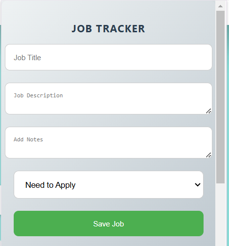
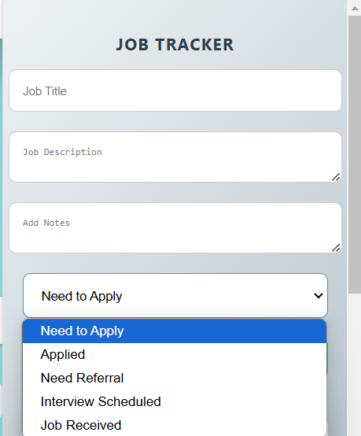
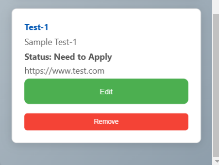

# Job Tracker

**Job Tracker** is a simple and intuitive chrome extension that helps users keep track of job applications. It allows users to manage job details like title, description, status, and notes.

# How I built it

- **Languages**: HTML, CSS, JavaScript.
- **Storage**: chrome.storage.local (for storing job data locally in the browser).
- **UI/UX**: Custom CSS styles for responsiveness and an engaging user interface.
- **Interactivity**: JavaScript to handle adding, displaying, and removing job entries.

# How to Run

1. Clone the repository:
   ```bash
   git clone <repository-url>
2. Open the Job Tracker folder.
3. Load the extension into your Chrome browser:
- Navigate to chrome://extensions/
- Enable Developer mode.
- Click Load unpacked and select the folder containing the extension files.
4. The extension will now be ready for use.

# Output:



